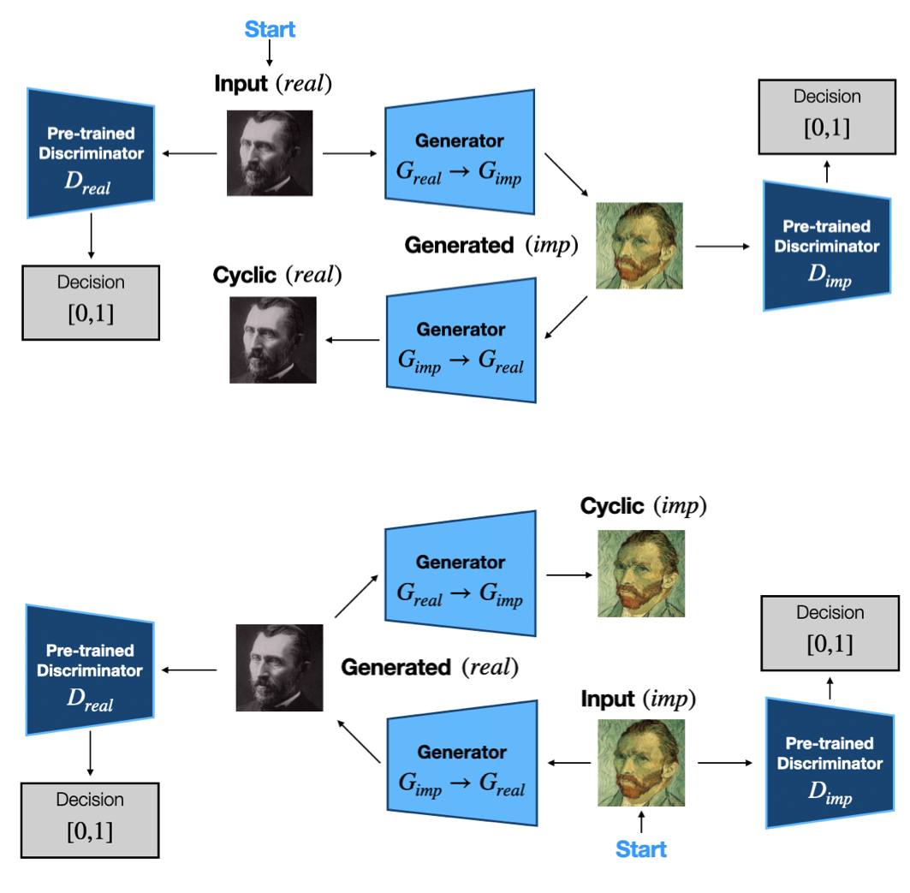

# Artistic Style Transfer with CycleGANs and Pre-trained Discriminators

This project implements an enhanced **CycleGAN** architecture for **image-to-image translation**, focusing on converting real-world photographs into **Impressionist-style paintings**. By incorporating **pre-trained discriminators** as binary classifiers, we aim to improve style fidelity and content accuracy, providing a robust approach to artistic style transfer.

Developed as part of the CSC413 Deep Learning and Neural Networks (Fall 2024) course at the University of Toronto.

This project was implemented by [David Chang](https://github.com/changoug), [Peter Jang](https://github.com/peterjangml), [Aaron Liu](https://github.com/Pix3ls126), and [Neil Mehta](https://github.com/mchappyneil?tab=overview&from=2024-12-01&to=2024-12-11).

## Table of Contents
- [Introduction](#introduction)
- [Features](#features)
- [Model Architecture](#model-architecture)
- [Installation](#installation)
- [Usage](#usage)
  - [Training the Model](#training-the-model)
  - [Image Conversion](#image-conversion)
- [Dataset](#dataset)
- [Results](#results)
- [Ethical Considerations](#ethical-considerations)

## Introduction

Artistic style transfer is a fascinating task within computer vision, bridging the gap between art and technology. This project introduces a **CycleGAN** model enhanced with pre-trained discriminators:
- **Discriminator 1**: Detects Impressionist style.
- **Discriminator 2**: Ensures authenticity of the generated images.

The project seeks to achieve high-quality stylization while preserving the content's essence. This model can be used for creative applications, digital art generation, and content enhancement.

## Features

- **Pre-trained Discriminators** for style-specific and authenticity evaluation.
- **Cycle-consistency loss** to preserve image structure.
- **Flexible Configuration** for training and testing.
- **Modular Implementation** to adapt and experiment with different styles or datasets.

## Model Architecture
<p align="center">
    
</p>

The architecture comprises:
- Two **Generators**: $G_{real2imp}$ and $G_{imp2real}$, responsible for bi-directional translation.
- Two **Discriminators**: Pre-trained to classify images as real, fake, or styled.
- Three Loss Functions:
  - **Adversarial Loss**: Encourages style adherence.
  - **Cycle-consistency Loss**: Preserves structural integrity.
  - **Identity Loss**: Maintains color coherence.

## Installation

1. Clone the repository:
```bash
git clone https://github.com/mchappyneil/CSC413-GouGAN.git
cd CSC413-GouGAN
```
2. Install all required libraries using `requirements.txt`.
Ensure torch and torchvision are installed with GPU support:
```bash
pip install -r requirements.txt
```
Alternatively:
```bash
pip install torch torchvision --index-url https://download.pytorch.org/whl/cu117
```
    
## Usage
#### Training the Model
1. Prepare the dataset (see [`util/data.ipynb`](util\data.ipynb))
2. Run the training script:
```bash
python train_generators.py --mode train
```

#### Image Conversion (Model Inference)
Use a trained model checkpoint:
```bash
python train_generators.py --mode convert --input path/to/image.jpg --output path/to/output.jpg --checkpoint path/to/checkpoint.pth
```

Alternatively, use the example bash script on a UNIX-based system to convert multiple images (`real2imp.sh`)

#### Dataset
The model uses four types of data:

1. Impressionist Art: Images of Impressionist paintings (e.g., Monet, Renoir).
2. Non-Impressionist Art: Images from other artistic styles.
3. Real-life Images: Photos from datasets like ImageNet
4. Synthetic Images: AI-generated fake real-life images.


#### Results
Detailed results can be found in the `./results/` directory.

## Ethical Considerations
- Copyright: Datasets like WikiArt are used responsibly as open-source.
- Legitimacy: The project respects artistic integrity and aims to assist rather than replace artists.
- Accuracy: Extensive testing ensures robust style transfer across various input domains.
- Privacy: No sensitive data is used; all datasets are open-source.

